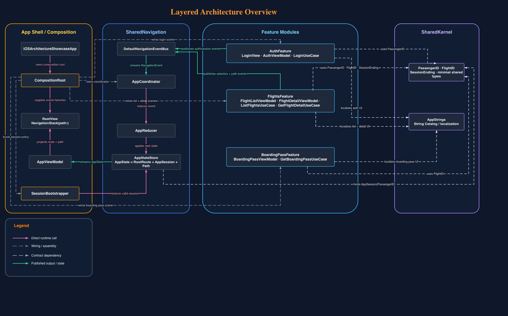
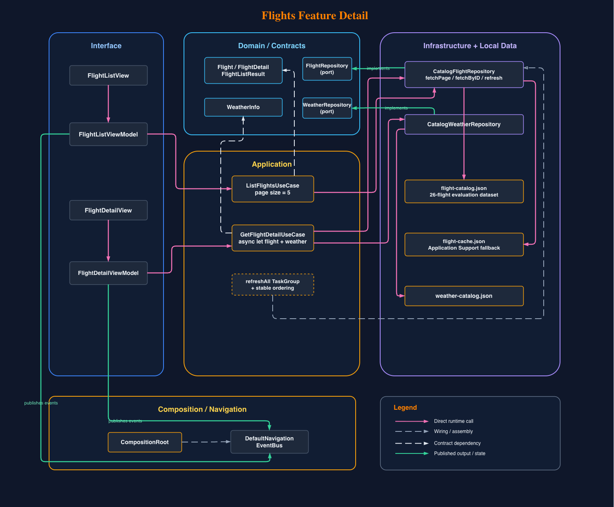

# iOS Architecture Showcase

[](https://github.com/SwiftEnProfundidad/ios-architecture-showcase/actions/workflows/ci.yml)
[](https://swift.org/)
[](https://developer.apple.com/ios/)

Enterprise-grade iOS showcase for passenger authentication, flight browsing, and boarding pass delivery. The repository follows `BDD -> TDD -> production code`, clean feature-first architecture, event-driven navigation, strict Swift concurrency, and zero third-party dependencies.

## Repository contract

- Functional source of truth: `docs/features/`
- Architectural/module contract: `Package.swift`
- Xcode wiring source of truth: `project.yml`
- Generated Xcode artifact: `iOSArchitectureShowcase.xcodeproj`
- Official validation command: `./scripts/validate.sh`
- Reviewer handoff: `docs/reviewer-guide.md`

## Start here in 3 minutes

If you want the shortest possible review path:

1. Run `./scripts/validate.sh`.
2. Open `docs/reviewer-guide.md`.
3. Open `docs/features/`.
4. Inspect `Package.swift` and `project.yml`.
5. Launch the app and follow the evaluation login flow.

The main reviewer-facing package is intentionally limited to:

- `README.md`
- `docs/reviewer-guide.md`
- `docs/features/`
- `Package.swift`
- `project.yml`
- `./scripts/validate.sh`

## Architecture diagrams

Editable diagrams live in `docs/architecture/*.drawio`. The `PNG` previews below are generated from those sources and reflect the current repository graph.

### Layered overview



### Auth feature detail


### Flights feature detail



## Bounded contexts

| Context | Responsibility |
|---|---|
| `AuthFeature` | Remote login over HTTP, session creation, and secure persistence |
| `FlightsFeature` | Paginated flight browsing, concurrent refresh, flight detail, and cache fallback |
| `BoardingPassFeature` | Boarding pass retrieval and native QR rendering |
| `SharedNavigation` | Event bus, reducer, state store, routes, and coordinator |
| `SharedKernel` | Shared IDs, minimal entities/contracts, and localized strings |
| `AppComposition` | Composition root, runtime wiring, session restoration, and scene assembly |

## Repository map

```text
Package.swift
Sources/
  App/
  AppComposition/
  Features/
    Auth/
    Flights/
    BoardingPass/
  Shared/
    Kernel/
    Navigation/
Tests/
docs/
  architecture/
  features/
project.yml
scripts/validate.sh
```

## What the app demonstrates

- Swift 6.2 with strict concurrency, actors, `AsyncStream`, `async let`, and `TaskGroup`
- Feature-first clean architecture without feature-to-feature imports
- A single navigation source of truth: `NavigationEvent -> AppReducer -> AppStateStore -> AppViewModel -> RootView`
- Runtime-authentication over `URLSession`, secure session persistence in Keychain, and local bootstrap fallback for evaluation
- A 26-flight evaluation portfolio with 10-flight incremental pages, bottom inline pagination spinner, cache-backed offline fallback, pull to refresh, and perceptible skeleton loading
- Adaptive light/dark presentation using native SwiftUI materials and semantic contrast
- English-first reviewer-facing documentation and runtime copy with localized string catalog support
- Swift Testing coverage across domain, application, navigation, and presentation
- Coverage gate enforced at `>= 85%` in local validation and CI

## Architecture guarantees

- `AppComposition` is the only module allowed to know all features at once.
- `AuthFeature`, `FlightsFeature`, and `BoardingPassFeature` do not import each other.
- Shared cross-feature surface is restricted to `SharedKernel` and `SharedNavigation`.
- The same validation entrypoint is used locally and in CI.
- Quality claims are backed by executable evidence, not by README-only promises.

## Local validation

```bash
./scripts/validate.sh
```

The script runs:

1. `swift build -c debug`
2. `swift test --parallel --enable-code-coverage`
3. `python3 scripts/coverage_gate.py --input-json <swift test --show-coverage-path> --threshold 85`
4. `xcodegen generate`
5. `xcodebuild -project iOSArchitectureShowcase.xcodeproj -scheme iOSArchitectureShowcase -destination "platform=iOS Simulator,name=<first available iPhone>" build test`

Local requirements:

- Swift 6.2 compatible toolchain
- Xcode 26.3 with an available iOS simulator
- `xcodegen` installed
- `drawio` available if you want to re-export diagram previews

## Reviewer quick path

If you only have a few minutes to review the repository:

1. Read the architecture overview and the two feature detail diagrams above.
2. Run `./scripts/validate.sh` to verify build, tests, coverage gate, Xcode generation, and simulator build/test in one pass.
3. Open `docs/features/` to see the BDD source of truth for auth, flights, boarding pass, navigation, and testing strategy.
4. Inspect `Package.swift` and `project.yml` to confirm modular boundaries, Swift 6.2, strict concurrency, and Xcode wiring.
5. Start the app and exercise the showcase flow: evaluation login, paginated flights, pull to refresh, detail, boarding pass, and logout.
6. Open `docs/reviewer-guide.md` if you want a shorter reviewer-facing summary of scope and guarantees.

## BDD coverage

- `docs/features/auth.feature`
- `docs/features/flights.feature`
- `docs/features/boarding-pass.feature`
- `docs/features/navigation.feature`
- `docs/features/testing.feature`

The specs cover successful and failed login, session restoration and expiry, paginated flight browsing, offline cache fallback, concurrent refresh, typed navigation, and boarding pass access rules.

## Testing scope for this technical assessment

- High-value automated coverage is prioritized over exhaustive automation.
- The repository enforces `BDD`, `unit`, `integration`, `regression`, render smoke, and a real coverage gate.
- The delivery deliberately does not include a broad `UI`, `performance`, or accessibility-automation suite.
- That omission is intentional for the scope of this technical assessment, not an accidental testing gap.

## Runtime authentication

Production runtime does not depend on `InMemory` repositories:

- Sessions are persisted in Keychain.
- Login uses `RemoteAuthGateway` over `URLSessionHTTPClient`.
- If `AUTH_BASE_URL` is configured in `SupportingFiles/Info.plist`, the app authenticates against that backend.
- If `AUTH_BASE_URL` is empty, the app uses a local HTTP bootstrap through `URLProtocol` while exercising the same transport contract.
- In bootstrap mode, the login screen exposes a one-tap evaluation path through `Use evaluation account`.

## Evaluation credentials

```text
Email: carlos@iberia.com
Password: Secure123!
```

## Fast functional smoke path

If you want the shortest possible product walkthrough:

1. Launch the app.
2. Confirm the cold start lands on login.
3. Tap `Use evaluation account`.
4. Tap `Sign in`.
5. Scroll the flight list until the next 10-flight page loads.
6. Pull to refresh once.
7. Open a flight detail.
8. Open the boarding pass.
9. Log out and confirm the app returns to login.

In local bootstrap mode, the showcase intentionally starts from login so the evaluation flow is always visible to the reviewer.
